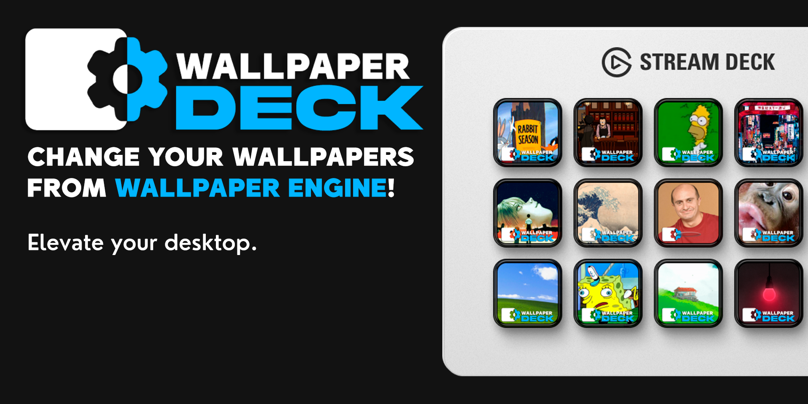

<h1 align="center">
   
  
</h1>

<h3 align="center">Switch Wallpaper Engine wallpapers directly from your Stream Deck.</h3>

  <a href="#key-features">Key Features</a> •
  <a href="#actions">Actions</a> •
  <a href="#setup">Setup</a> •
  <a href="#requirements">Requirements</a> •
  <a href="#download">Download</a> •
  <a href="#support">Support</a> •
  <a href="#license">License</a>

<h1 align="center">
  
</h1>

**Wallpaper Deck** is a Stream Deck plugin that lets you switch [Wallpaper Engine](https://www.wallpaperengine.io/) wallpapers instantly from a single button press — no alt-tabbing, no menus. Each key shows a live preview of the wallpaper it will activate, so your deck becomes a visual wallpaper gallery.

---

## Key Features

- **Instant wallpaper switching** — press a key, change your wallpaper.
- **Wallpaper preview on the button** — the key image shows the actual preview thumbnail of the wallpaper assigned to it.
- **Auto-detects your installation** — finds Wallpaper Engine and your Steam Workshop folder automatically via the Windows registry. No manual path configuration needed in most cases.
- **Works on Windows 10 and 11.**

---

## Actions

### Change Wallpaper

> _One press. One wallpaper._

Assigns a Wallpaper Engine wallpaper to a Stream Deck key. Pressing the key instantly activates that wallpaper on your desktop. The key displays the wallpaper's preview thumbnail so you always know what each button does at a glance.

---

## Requirements

- **Stream Deck** 7.1 or later
- **Windows** 10 or 11
- **Wallpaper Engine** installed via Steam

---

## Download

Get the latest release from the [Stream Deck Marketplace](https://marketplace.elgato.com) or the [GitHub Releases page](https://github.com/unaigonzalezz/wallpaper-deck/releases).

---

## Setup

1. **Install the plugin** from the Stream Deck Marketplace or from the Releases page.
2. **Drag the "Change Wallpaper" action** onto any key on your Stream Deck.
3. **Select a wallpaper** from the dropdown — your installed wallpapers will be listed automatically.
5. **Press the key** to activate the wallpaper.

> **Note:** Wallpaper Deck auto-detects Wallpaper Engine and your Steam Workshop folder on first use. If detection fails, the Advanced section in the property inspector lets you set the paths manually.

---

## Support

If you would like to support development:

If you can't donate, leaving a ⭐ on the repo goes a long way — it genuinely makes my day.

---

## Future improvements

- Support for multiple monitors and monitor-specific wallpaper switching.
- Playlist / random wallpaper mode — cycle through a set of wallpapers on a timer or key press.
- Animated preview thumbnails for video wallpapers.

Feel free to suggest new features in the Discussions tab.

---

## Contributing

Pull requests are welcome. For major changes, open an issue first to discuss what you would like to improve.

---

## Thanks

- [Wallpaper Engine](https://www.wallpaperengine.io/) for the wallpaper platform that made this possible.
- [Google](https://google.com) for Material Icons.

---

## License

[MIT](https://choosealicense.com/licenses/mit/)

---
